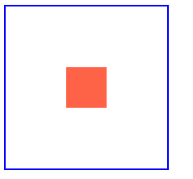

# [TIL] CSS_Position

## `position` : 위치 관련 스타일

### `static` : 기본값
> 문서를 요소의 일반적인 흐름에 따라 배치

<br>

### `relative` : 상대적 배치
> static과 같으나 `top`, `bottom`, `left`, `right`속성을 지정 가능
> - `absolute`를 포함하는 부모 요소로 주로 사용됨

<br>

### `absolute` : 절대적 배치
> 족보상 가장 가까운, `static`인 아닌 조상 기준 상대적 위치에 배치
> - 페이지 내 **공간을 차지하지 않음**
> - static이 아닌 요소들끼리는 `z-index`값으로 위, 아래(앞쪽, 뒷쪽) 배치

<br>

### `fixed` : 고정
> 부모 요소가 아닌, viewport를 기준으로 배치
> - **스크롤에 영향을 받지 않음**
> - 페이지 내 **공간을 차지하지 않음**

<br>

## position속성을 활용해 item 을 가운데 정렬하는 방법

```html
<body>
  <main>
    <div class="item"></div>
  </main>
</body>
```

```css
main {
  width: 200px;
  height: 200px;
  border: 2px solid blue;
  position: relative;
  
}

.item{
  width: 50px;
  height: 50px;
  background-color: tomato;

  /* item을 가운데로 배치하기 */
  position: absolute;
  top: 50%;
  left: 50%;
  transform: translate(-50%, -50%);
}
```

[결과] <br>
