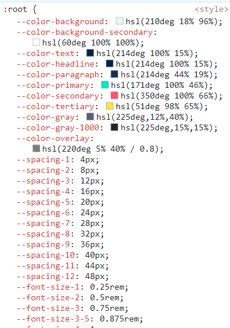
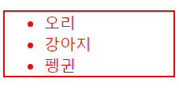

# [TIL] CSS_변수
CSS에서 변수를 활용하여 동일하게 사용된 값을 좀 더 효율적으로 관리할 수 있다.
<br>


## css 변수 선언
CSS에서 변수명을 지정하려면 변수명 앞에 `--` 로 시작해야 한다.

> `--변수명`


## CSS 변수 호출
만든 변수명을 사용하려면 `var(변수명)` 형식처럼 작성해야 한다.
> `var(변수명)`

<br>

## CSS 전역 변수
CSS의 `:root` 의사클래스는 문서 트리의 루트 요소로써, `:root = <html>` 와 같다. <br>
`:root`에 CSS 변수를 선언해서 사용한다. (=일종의 전역 변수 영역)

```css
:root {
  --main-color: #ff0000;
  --size: 50px;
}

div {
  color: var(--main-color);
  font-size: var(--size);
}
```

<br>

## CSS 변수 상속
CSS 변수는 상위요소에서 하위요소로 상속되기 때문에 상위요소에 정의된 CSS 변수를 하위요소에서 자유롭게 접근할 수 있다.

```html
<ul>
  <li>오리</li>
  <li>강아지</li>
  <li>펭귄</li>
</ul>
```
```css
/* 상위요소 */
ul {
  --color: red;
  border: 2px solid var(--color);
}

/* 하위요소 */
li {
    color: var(--color);
  }
```

<br>
→ 상위요소인 ul태그에 변수를 지정했고, 하위요소인 li태그에 ul에 지정한 변수를 호출시켰더니, 화면에 반영되는 것을 확인할 수 있다.

<br>

## css 변수 대체값 설정
CSS 변수가 너무 많아 변수가 정의되어 있는지 잘 모를 때, `var()` 함수의 두번째 인자로 기본값(=대체값)을 설정할 수 있다.

> `var(변수명, 기본(대체)값)`

```css
/* primary-color 변수만 정의되어 있고, second-color는 정의되지 않은 상태 */

: root {
  --primary-color: gold;
}

/* primary-color가 정의되어 있기 때문에 item1 배경색은 gold가 나타난다. */
.item1{
  background-color: var(--primary-color, orange);
}

/* second-color가 정의되어 있기 때문에 item1 배경색은 orange가 나타난다. */
.item2{
  background-color: var(--second-color, orange);
}
```


<br>
<br>

## CSS 변수 주의사항

### 변수로 단위값을 사용할 때 주의사항
만약 속성의 단위값을 변수로 처리할 때, 아래와 같이 처리하면 에러가 발생한다.

```css
/* ❌잘못된 사용법 */

div {
  --p: 20;
  width: var(--p)vw;
  height: var(--p)vh;
}
```
→ 이렇게 사용하면 `width: 20 vw;` 변수와 단위 사이에 띄어쓰기가 적용되어 에러를 발생시킨다.

```css
/* ⭕올바른 사용법 */
div {
  --p: 20;
  width: cal(var(--p) * 1vw);
  height: cal(var(--p) * 1vh);
}
```
→ `cal()`함수를 활용해 `width: 20vw`를 나타낼 수 있다.

<br>
<br>

## CSS 변수 활용법

### rgb색상 및 투명도 설정하기

```css
/* rgba(240, 240, 240, 70%) */

:root {
  --color: 240, 240, 240;
  --alpha: 0.7;
}

div {
	background-color: rgba(var(--color), var(--alpha)); 
}
```

<br>

### background-image의 url 변수 설정하기
css 변수 선언 시, url(이미지경로) 자체를 변수화하여 사용해야 한다.

```css
:root {
	--img: url("img/sample.jpg");
}

div {
    background: var(--img);
}
```