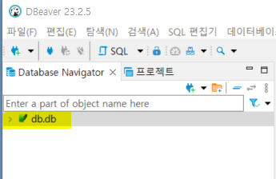
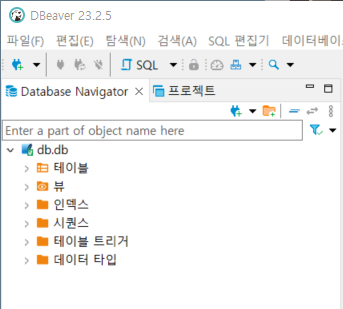
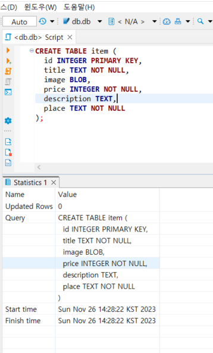
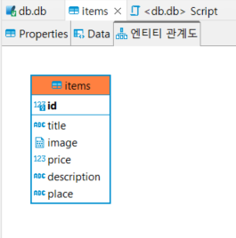

# DBeaver ERD 사용방법
https://dbeaver.io/

## 1. DBeaver 기본 셋팅하기

### 1) 파일 다운로드 설치

### 2) `새 데이터베이스` 연결 선택
- [ctrl] + [shift] + [N]
- 내 데이터베이스로 사용할 것을 선택 <br>
  → 보통 `SQLite` 버전 사용

### 3) 내가 작업하고 있는 폴더 path (경로) 연결
- 현재 작업하고 있는 폴더를 가져온다.
- 파일 이름은 `파일명.db` 로 입력해서 [저장] 누르면 된다.

- 생성된 db 파일의 [ `>` ] 버튼 클릭 → 창 생성 -  [다운로드] 버튼 클릭


<br>
<br>

## 2. 데이터베이스 만들기

### 1) SQL 편집기 열기
: 만든 DB 파일에 [마우스 우클릭] - [`SQL편집기`] 선택

### 2) CREATE TABLE 문법 작성

```SQL
CREATE TABLE items (
  id INTEGER PRIMARY KEY,
  title TEXT NOT NULL,
  image BLOB,
  price INTEGER NOT NULL,
  description TEXT,
  place TEXT NOT NULL
);
```

- ID라는 값으로 각각의 항목들을 식별하기 위해 `PRIMARY KEY` 작성

### 3) 작성한 테이블 실행하기
- SQL 편집기에 있는 [ `▶` ] 클릭하면 작성한 테이블이 실행 - 하단에 정보가 나타남
- 단축키 : [ctrl] + [Enter]

- 왼쪽 [`테이블`] 더블클릭하면 내가 만든 items 테이블이 생성되는 것을 볼 수 있다.
- 만든 items 테이블의 형태를 보려면 [마우스 우클릭] - [`다이어그램보기`] 클릭


<br>
<br>

## 3. main.py로 가서 서버 연결하기

### 1) html 구현 및 main.py파일에서 기본 셋팅하기

```python
from fastapi import FastAPI, UploadFile
from fastapi.staticfiles import StaticFiles
from typing import Annotated

app = FastAPI()

@app.post('/items')
def create_item(image:UploadFile,
                title:Annotated[str, Form()],
                price:Annotated[int, Form()],
                description:Annotated[str, Form()],
                place:Annotated[str, Form()]):
  print(image,title,price,description,place)
  return '200 - ok'


app.mount("/", StaticFiles(directory='frontend', html=True), name='frontend')
```

<br>
