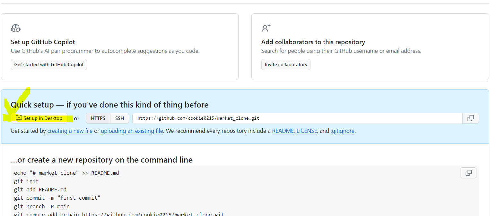
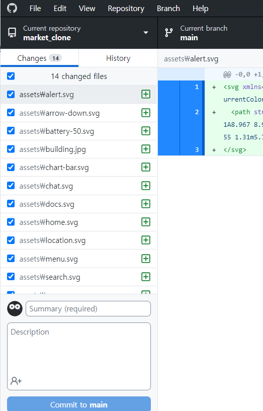
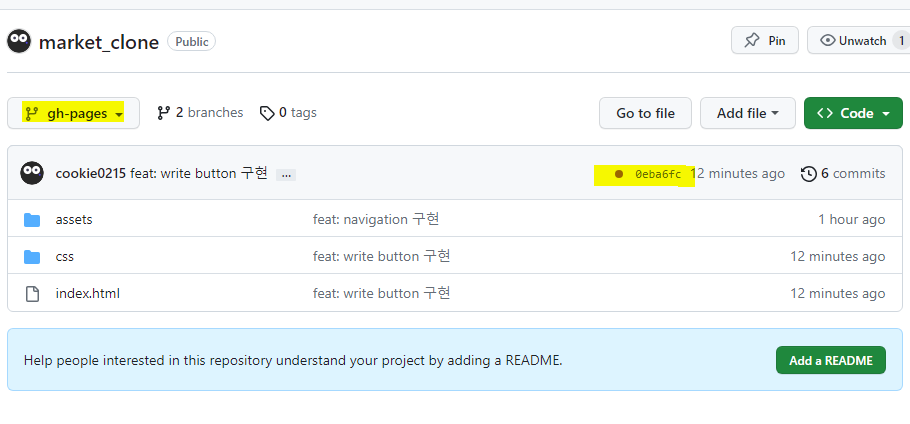

# 데스크톱에서 github 사용하기

### 0. 설치하기
: 내 컴퓨터 환경에서 desktop github을 사용할 수 있도록 https://desktop.github.com/ 사이트에서에서 파일을 다운로드 하고 설치한다.

 

### 1. github에서 새 repository 만들기
: 깃헙 사이트에서 새 저장소를 만들고, 아래 사진에 나와 있는 `set up in Desktop`을 클릭한다.
→ github Desktop 창이 생성되는 것을 볼 수 있다.

 

### 2. local path 를 지정해준다.
: 새롭게 만든 repository을 내 컴퓨터에 연결하기 위해 폴더 경로를 지정해준다.

 

### 3. 생성된 폴더에 html,css 등 파일을 넣는다.

→ 폴더에 추가된 파일들이 쭉 나타나는 것을 볼 수 있다.

### 4. commit 메세지를 적고 `commit to main` 을 클릭
: [summary] 부분에 작성한 커밋 메세지와 설명을 적고 `commit to main`을 누른다.

### 5. `push origin`를 클릭
: push origin를 누르면 github저장소에 업로드 된 것을 볼 수 있다.

 
 

## github pages 배포하기

### `1. main branch가 아닌 새 branch 만들기`
: [branch] - [New branch] - "gh-pages" 라고 입력 후, [create branch] 버튼 클릭

### `current branch를 gh-pages로 두고, [publish branch] 클릭`

→ gh-pages 브랜치에서 내가 만든 프로젝트가 배포되는 중임임을 확인할 수 있다.
 
노란색 동그라미 : 배포 진행 중  
초록색 체크표시 : 배포 완료

 
 

## 업데이트된 내용 github pages에 배포하기

### 1. 우선 main 브랜치에서 업데이트할 부분을 작업한다.

### 2. [add] - [commit] 한다.

### 3. gh-pages 브랜치로 이동한다.

### 4. gh-pages 브랜치에서 `[branch] - [merge into current branch]`를 클릭한다.

### 5. "Merge into gh-pages"창이 나타나면 `[create merge commit]`을 클릭한다.

### 6. 그다음 gh-pages 브랜치는 그대로 두고 [push origin] 클릭

### 7. 끝