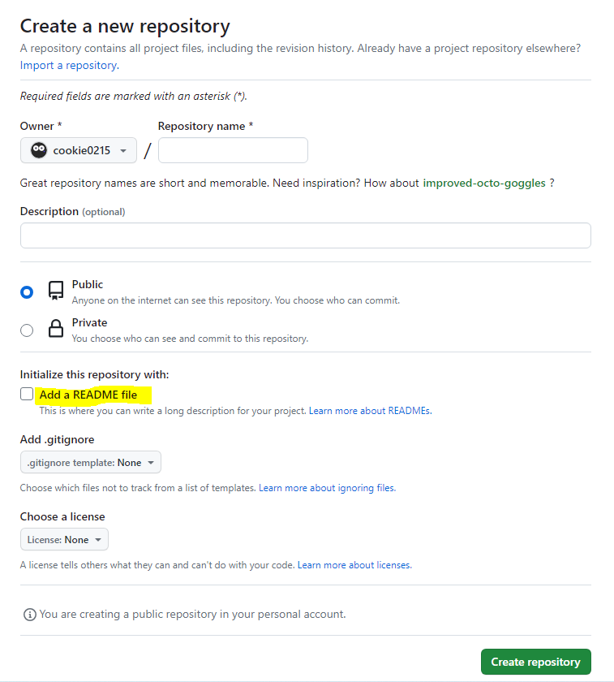

# github에 파일 업로드 하는 방법
해당 순서에 맞게 github에 파일을 업로드 할 수 있다.

<br>

## 1. git 설치하기
https://git-scm.com/downloads

## 2. Github에 저장소(repository) 만들기

- Repository name 작성
-  `Add a README file` 항목 체크하지 말기★ <br>
    *→ 이따 뒤에 push할 때, 에러가 발생해서 해결하는 데 꽤 걸렸다...*

<br>

## 3. git bash here
: 내가 업로드하고 싶은 프로젝트 폴더에 [마우스 우클릭] → [ `git bash here` ]를 클릭한다.

## 4. 초기설정하기
: 생성된 git bash창에서 github에서 사용하는 `user.name`과 `user.email`을 차례대로 초기 설정을 해준다.

```bash
$ git config --global user.name "이름"
$ git config --global user.email "이메일"
```

<br>
<br>


## 5. git 파일 생성 및 업로드 하기
: 1-4번까지의 초기 설정이 끝났으면, 이제 git bash에서 아래와 같이 순차적으로 진행해주면 된다.

### `1) $ git init`
: git bash에 git init을 입력하면 해당 폴더에 `.git`이라는 숨김폴더가 생성되는 것을 확인할 수 있다.

> *해당 폴더에 `.git`폴더가 보이지 않는다면, 해당 폴더 상단에 [보기] 탭 - [표시/숨기기] - [숨김항목]을 체크해주면 된다*


### `2) $ git add .`
: 선택한 프로젝트 폴더내의 `모든 파일을 추가`한다.

> 만약 폴더내의 특정 파일만 추가하고 싶을 땐, <br>
> `$ git add 파일이름.파일형식` 으로 입력하기

### `3) $ git commit`
- `파일의 변화에 대해 기록하는 것`으로 해당 파일이 어떤 기능이 구현되었는지, 어떤 부분을 수정했는지 등의 변경사항을 기록하는 공간이다.

- 커밋메세지는 `vim모드`와 `간략형` 2가지 형태로 작성할 수 있다.


  > ## commit 간략형
  > $ git commit -m "커밋메세지작성란"

  <br>

  > ## $ git commit 만 입력 시 <br>
  > : 커밋메세지를 작성할 수 있는 vim모드 진입하게 된다.
  >
  > 1. **`i`** 입력 <br> 
  > → 하단에 --INSERT--라는 메모가 나타나며 글을 작성할 수 있는 `edit 모드로 바뀐다`.  <br>
  >
  > 2. 내용을 작성한다.
  > 3. [ `ESC` ] 누르기
  > 4. **`:wp`** 입력 후 [ `Enter` ] 누르기 <br>
  > → [w]는 저장을, [q]는 편집기로 이동하는 것을 의미하고,
  동시에 같이 입력하면 저장하고 vim모드를 빠져나올 수 있다.

<br>
<br>

### `4) $ git remote add origin {생성한 repository 주소}`
: 아까 Github에서 만든 저장소(repository)에서 주소를 복사해 터미널에 위와 같이 입력한다.

```bash
$ git remote add origin https://github.com/cookie0215/TIL.git
```

### `5) git push origin 브랜치이름`
```bash
$ git push origin main
```
: git push까지 정상적으로 마치면 로컬저장소(내 컴퓨터)에 있는 해당 폴더가 원격저장소(github저장소)로 업로드 된 것을 볼 수 있다.

<br>
<hr>

⛔ `git push origin main` 입력 시, 만난 에러 메세지
```bash
! [rejected]        main -> main (fetch first)
error: failed to push some refs to 'https://github.com/cookie0215/TIL.git'
```
💡 **[원인]** <br>
: `github저장소에 내 컴퓨터(로컬저장소)에는 없는 파일이 있을때 발생한 에러` 메세지로, github 저장소에 있는 기존 데이터가 손실될 수 있어서 push를 막은 것이다. <br>

→ 즉, 내가 맨 처음 github에서 repository를 만들 때, `Add a README file` 항목을 체크하고 만들었었는데, 이때 github저장소에 README.md 파일이 생겼고, 내 컴퓨터(로컬)상에는 README.md 파일이 없기 때문에 서로 환경이 일치하지 않아 문제가 발생한 것이다.

✅ **[해결방법]** <br>
1. **강제로 push를 진행하는 방법**
    ```bash
    $ git push origin +main
    ```
    : github저장소에 있는 파일을 **강제로 삭제**시킨다.

<br>

2. **github저장소 파일을 당겨와 내 컴퓨터(로컬저장소)파일로 동기화 시킨다.**
    ```bash
    $ git pull --rebase oirign main
    ```

위 2가지 방법 중에서 시도 후, 다시 `git push origin main`을 입력하면 정상적으로 파일이 github저장소에 업로드 되는 것을 볼 수 있다.

<br>
<br>
<br>

## 6. 기존 저장소에 새롭게 작업한 내용을 업로드하기
: (pull) - add - commit - push 과정 순으로 입력해서 파일을 계속 업로드 시키면 된다.

```bash
$ ( git pull origin main )
$ git add .
$ git commit -m "commit message"
$ git push origin main
```